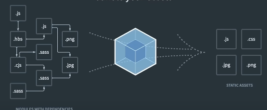

https://www.youtube.com/watch?v=37SwqREHRGI&t=3779s

### EcmaScript

Convenções de padrões para as linguagens de navegadores


### Babel

Compilador para o browser entender o JavaScript. O JS evolui mais rápido do que os navegadores, logo é necessário que algumas funcionalidades do JS sejam transformadas em linguagem que o browser entenda. Exemplo:

```javascript
    const teste = 0??10;

    // Transformado pelo Babel
    var _;
    const teste = (_ = 0) != null ? _ : 10;
```

### Webpack

Bundler (enpacotador) que pega vários arquivos da aplicação e transform em um único arquivo. Antigamente, não era possível fazer importações de arquivos no browser, então o webpack surgiu como alternativa de transformar todos os arquivos em um único arquivo



Outras opções SWC, esbuild
